# 🏏 IPL Data Analysis Project – Azure Data Factory & Databricks (Medallion Architecture)

This project demonstrates an **end-to-end Data Engineering pipeline** using **Azure Data Factory (ADF)**, **Azure Databricks**, and **Azure Data Lake Storage Gen2 (ADLS Gen2)**.  
It is based on the **Medallion Architecture (Bronze → Silver → Gold)** and processes **IPL cricket data (matches & deliveries)** to build analytical insights.

---

## 🚀 Project Architecture

The project follows the Medallion architecture with three layers:

1. **Bronze Layer** – Stores raw data from the source system in Delta format.  
2. **Silver Layer** – Performs cleaning, transformations, and incremental loads.  
3. **Gold Layer** – Stores aggregated and business-ready data (e.g., Batsman performance summary).

📌 **Architecture Diagram**  
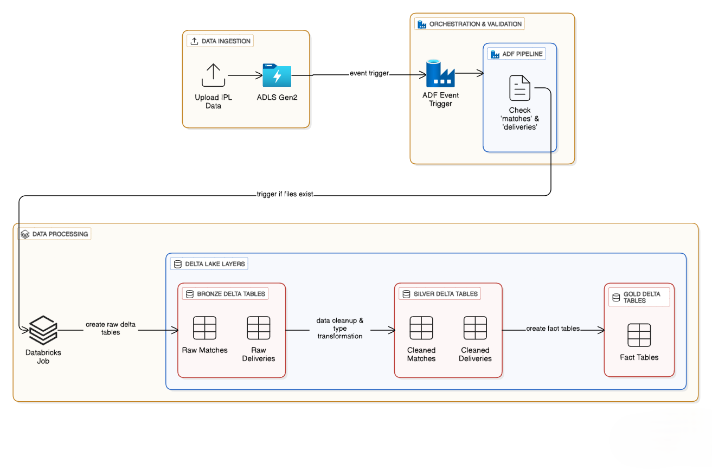  

---

## 🔄 Data Flow

1. **ADF Master Pipeline**  
   - Triggers automatically when new data lands in the **bronze container** in ADLS Gen2.  
   - Uses **Get Metadata** and **If Condition** activity to check whether **both files (`matches` & `deliveries`)** are present.  
   - If yes → Extracts the file names and passes them as **parameters** to a Databricks job.  

   📌 ** ADF Master Pipeline
   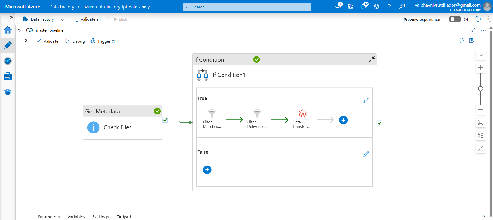  

3. **Databricks Job Workflow**

   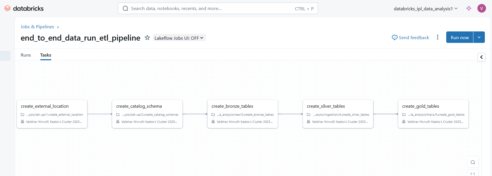
   
   - **Step 1: Create External Location**  
     Configures access to ADLS Gen2.

   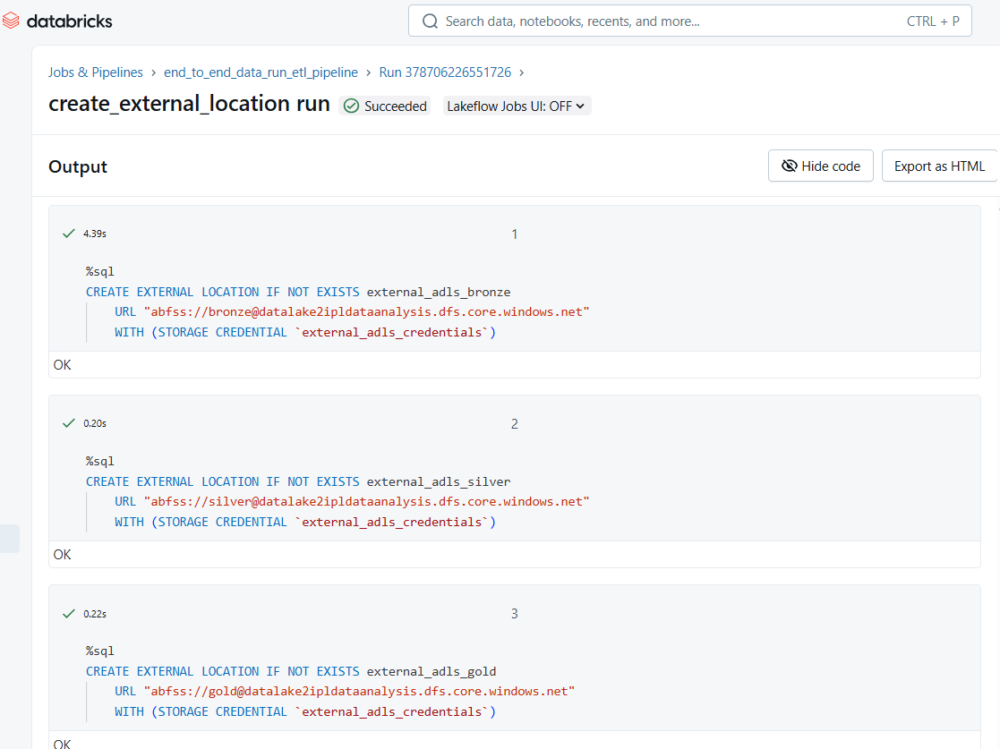

   - **Step 2: Create Catalog & Schemas**  
     Creates:
     - Catalog: `ipl_data_analysis_catalog`  
     - Schemas: `bronze`, `silver`, `gold`
       
   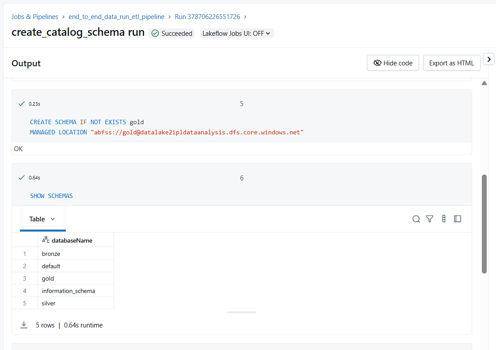

   - **Step 3: Create Bronze Tables**  
     Raw files (`matches`, `deliveries`) are stored as **Delta tables** in the bronze layer.  
     Metadata columns added: `data_source`, `ingestion_date`
     
   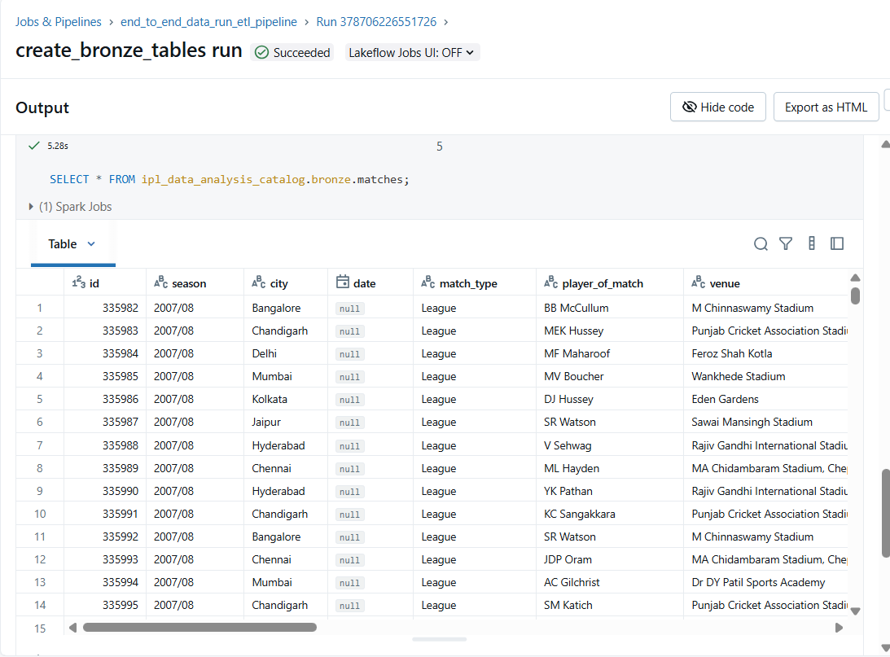
   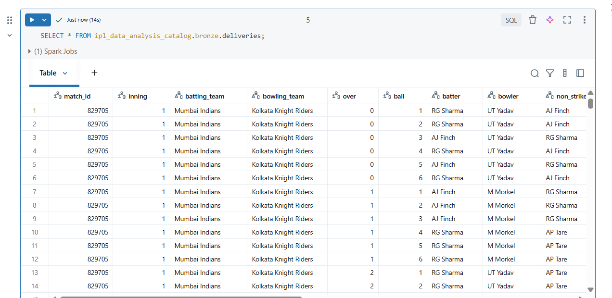

   - **Step 4: Create Silver Tables**  
     - Incremental load applied  
       - `matches` → Incremental on `match_id`  
       - `deliveries` → Incremental on (`match_id`, `inning`, `over`, `ball`)  
     - Null handling, cleaning & schema enforcement performed.
       
   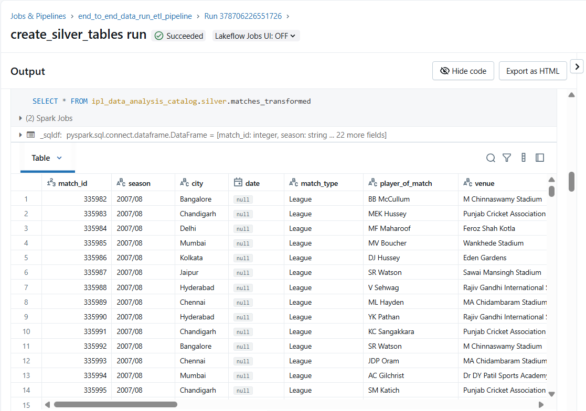
   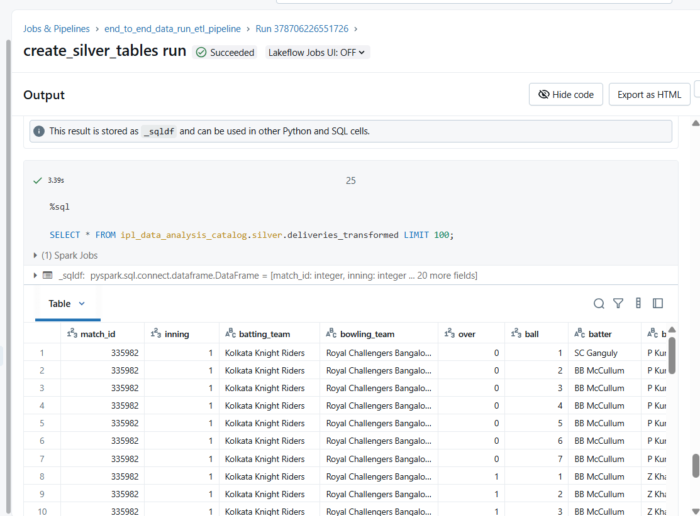

   - **Step 5: Create Gold Tables**  
     - Analytical tables prepared (example: **Batsman Performance Summary**)  
       - Total runs  
       - Balls faced  
       - Strike rate & other metrics
         
   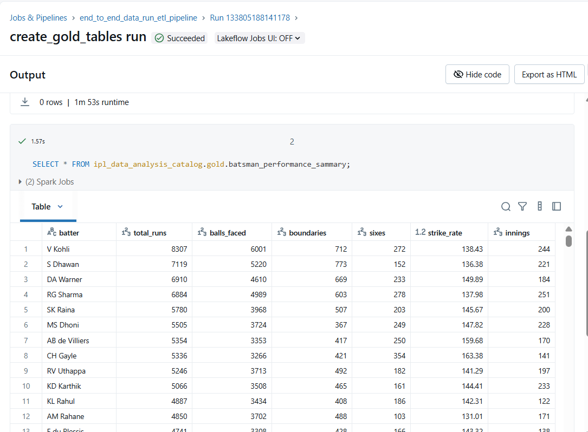

   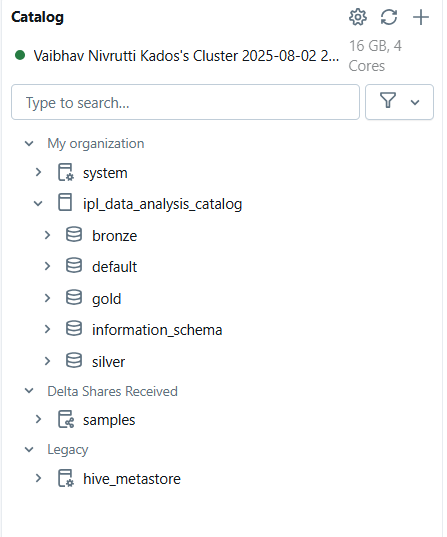

---

## 🗂 Project Structure

```
ipl-databricks-adf-etl-data-engineering-project/
│── adf/ # ADF pipeline JSON exports
│── architecture/ # Architecture diagrams
│── databricksNotebooks/ # Databricks notebooks (ETL code)
│── images/ # Screenshots (pipelines, notebooks)
│── sourceData/ # Raw input files (matches, deliveries)
│── README.md # Project documentation
```
---


## ⚙️ Technologies Used

- **Azure Data Factory (ADF)** – Orchestration & pipeline automation  
- **Azure Databricks** – Data processing & transformation  
- **ADLS Gen2** – Storage for raw & processed data  
- **Delta Lake** – For incremental loads & ACID transactions  
- **PySpark / SQL** – Transformations & aggregations  

---

## 📊 Final Output (Gold Layer)

**Batsman Performance Summary Table Initial Load**

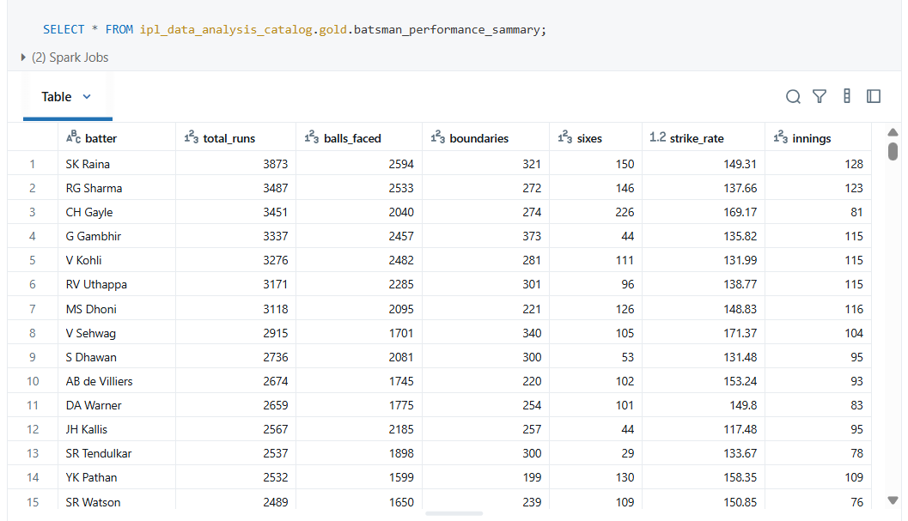

**Batsman Performance Summary Table Incremental Load**  


---

## 📌 How to Run This Project

1. Upload raw `matches.csv` and `deliveries.csv` files to **bronze container** in ADLS Gen2.  
2. ADF Master Pipeline triggers automatically → validates files → invokes Databricks job.  
3. Databricks notebooks process data into **Bronze → Silver → Gold** layers.  
4. Query Gold tables for analytics using **Databricks SQL** / **Power BI**.

---

## 🏆 Key Learnings

- Implemented **Medallion Architecture** in Azure.  
- Built **incremental pipelines** using Delta Lake.  
- Automated **data ingestion → transformation → analytics** workflow with ADF + Databricks.  
- Designed reusable & scalable architecture for future datasets.  

---

## 👨‍💻 Author

**Vaibhav Kados**  
- Azure Data Engineer | Data Enthusiast  
- [LinkedIn](https://www.linkedin.com/in/vaibhav-kados-45689020a/) | [GitHub](https://github.com/vaibhav-kados)
